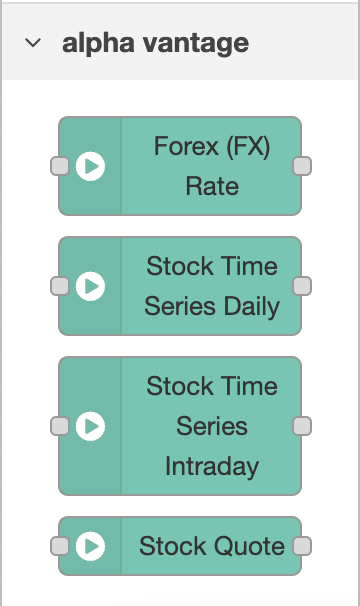

# node-red-contrib-alphavantage

> NodeRED nodes for getting data from Alpha Vantage API.
> This is a forked implementation of `node-red-contrib-alphavantage` as the maintainer is delayed on the pull request

The node requires node.js version 12 or more recent, and has been tested with version 18.4.0

This node uses Alpha Vantage API and require *API key*. Claim your free API key [here](https://www.alphavantage.co/support/#api-key).
Free API key allowes up to 5 API requests per minute and 500 requests per day.

## Pre-requisites

This plugin requires [Node-RED](https://nodered.org) to be installed, and has been tested with Node-RED version 2.2.2.  Earlier versions may also be supported, but have not yet been tested

## Install

You can install either through the Node-RED palette settings or by the following command

    npm i --unsafe-perm @bikerpatch/node-red-contrib-alphavantage

## Usage

There is 3 new nodes which is added to the `alpha vantage` category

### Capability: Stock Time Series Intraday

The `Stock Time Series Intraday` capability allows the flow designer to retrieve time series intraday data for a given stock.

Ref: https://www.alphavantage.co/documentation/#intraday

### Capability: Stock Time Series Daily

The `Stock Time Series Daily` capability allows the flow designer to retrieve time series daily data for a given stock.

Ref: https://www.alphavantage.co/documentation/#daily

### Capability: Stock Quote

The `Stock Quote` capability allows the flow designer to retrieve the latest point in time price data for a given stock.

Ref: https://www.alphavantage.co/documentation/#latestprice

### Capability: Forex (FX) Rate

The `Forex (FX) Rate` capability allows the flow designer to retrieve the latest point in time conversion rate between currencies (both digital and physical).

Ref: https://www.alphavantage.co/documentation/#currency-exchange

## Flow Examples

For examples of how to use, see the [provided example flow](https://github.com/bikerpatch/node-red-contrib-alphavantage/tree/main/examples)

## Functionality

Stock Time Series
 - [X] Intraday
 - [X] Daily
 - [ ] Daily Adjusted
 - [ ] Weekly
 - [ ] Weekly Adjusted
 - [ ] Monthly
 - [ ] Monthly Adjusted
 - [X] Quote Endpoint
 - [ ] Search Endpoint

Forex (FX)
 - [X] Exchange Rates
 - [ ] Intraday
 - [ ] Daily
 - [ ] Weekly
 - [ ] Monthly

Cryptocurrencies
 - [ ] Exchange Rates
 - [ ] Daily
 - [ ] Weekly
 - [ ] Monthly

Technical Indicators
 - [ ] SMA
 - [ ] EMA
 - [ ] WMA
 - [ ] DEMA
 - [ ] TEMA
 - [ ] TRIMA
 - [ ] KAMA
 - [ ] MAMA
 - [ ] VWAP
 - [ ] T3
 - [ ] MACD
 - [ ] MACDEXT
 - [ ] STOCH
 - [ ] STOCHF
 - [ ] RSI
 - [ ] STOCHRSI
 - [ ] WILLR
 - [ ] ADX
 - [ ] ADXR
 - [ ] APO
 - [ ] PPO
 - [ ] MOM
 - [ ] BOP
 - [ ] CCI
 - [ ] CMO
 - [ ] ROC
 - [ ] ROCR
 - [ ] AROON
 - [ ] AROONOSC
 - [ ] MFI
 - [ ] TRIX
 - [ ] ULTOSC
 - [ ] DX
 - [ ] MINUS_DI
 - [ ] PLUS_DI
 - [ ] MINUS_DM
 - [ ] PLUS_DM
 - [ ] BBANDS
 - [ ] MIDPOINT
 - [ ] MIDPRICE
 - [ ] SAR
 - [ ] TRANGE
 - [ ] ATR
 - [ ] NATR
 - [ ] AD
 - [ ] ADOSC
 - [ ] OBV
 - [ ] HT_TRENDLINE
 - [ ] HT_SINE
 - [ ] HT_TRENDMODE
 - [ ] HT_DCPERIOD
 - [ ] HT_DCPHASE
 - [ ] HT_PHASOR

Sector Performances
 - [ ] SECTOR

## Contributing

Creation of issues and pull requests for fixes/new features are welcome.  These will be reviewed on an ad-hoc basis as time permits.

## Disclaimer

This project is in no way associated with [Alpha Vantage](https://www.alphavantage.co).  The code is offered as-is and should be used with care.  It's intended use is not for production commercial environments and as such there is no commercial support offered.
